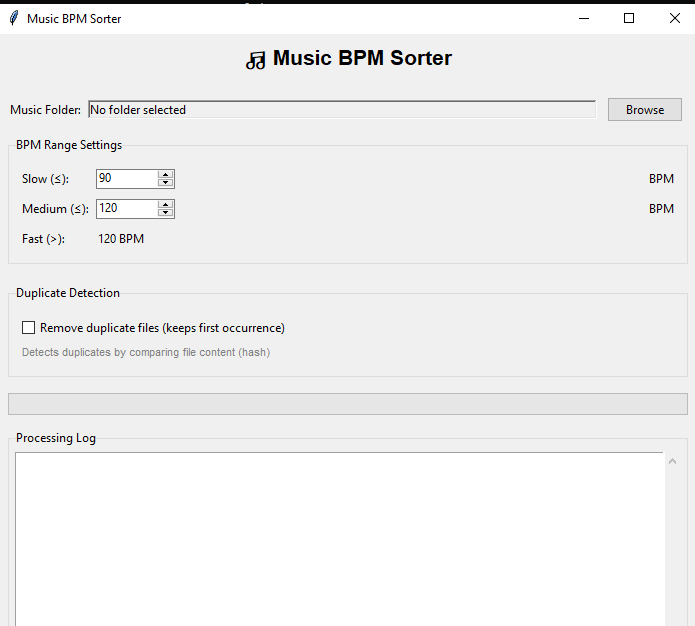

# BPM Sampler

A Python script that analyzes audio files in a selected folder and sorts them into three categories based on their BPM (beats per minute): Slow (<90 BPM), Medium (90-120 BPM), and Fast (>120 BPM).

## Screenshot

*Screenshot of the folder selection dialog and processing output.*

## Requirements

- Python 3.x
- librosa (install with `pip install librosa`)

## Installation

1. Ensure Python is installed on your system.
2. Install the required library: `pip install librosa`

## Usage

1. Run the script: `python bpm_sampler.py`
2. Select the music folder containing audio files (.mp3, .wav, .flac, .ogg).
3. The script will analyze each file, detect its BPM, and move it to the appropriate subfolder (Slow, Medium, or Fast).

**Note:** The script moves files from the original folder. Make sure to back up your music files before running.

## Supported Formats

- MP3
- WAV
- FLAC
- OGG

## Disclaimer

This script uses audio analysis to estimate BPM. Results may not be 100% accurate for all tracks.

## Source Code

The main script is available at [bpm_sampler.py](bpm_sampler.py).